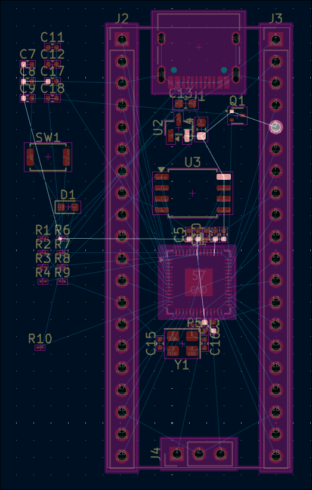
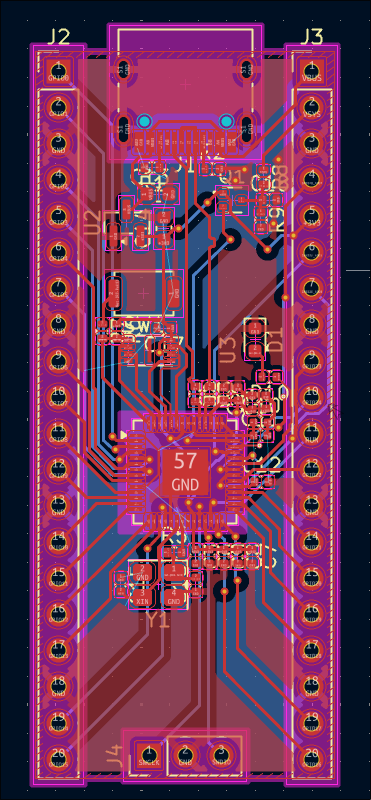
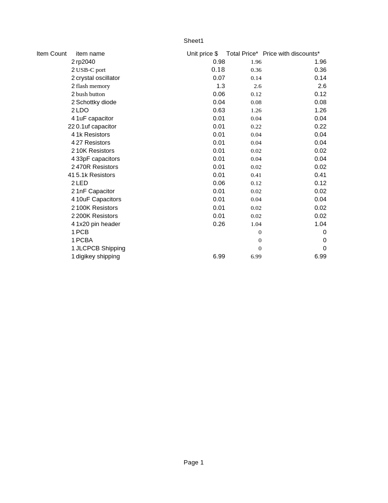
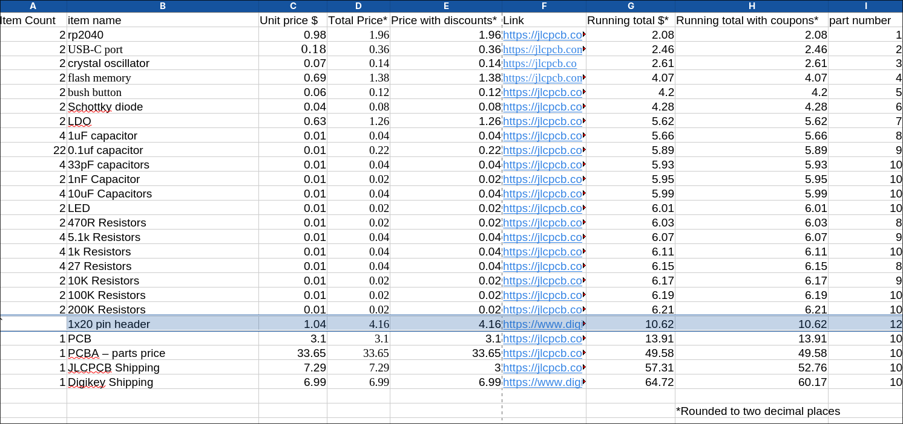

# May 5th, 2026: Got started on the schematic

Got started on making the devboard part of the project. i am making a custom rp2040 devboard that will slot into the base/main pcb of the name tag.

**Total time spent: 2h**

# May 6th, 2026: finnished the schematic

I figured out how to use a battery to power the rp2040 and finished connecting all the nets where they need to go. i also got all of the foot prints assigned.

**Total time spent: 1.5h**

# May 7th, 2026: Started placing the footprints
Start time: 19:50
I decided to switch from having the custom devboard and the name tag be two seperate projects so i wouldnt have to worry about how i will order the pcbs. I got a bunch of footprints placed though fine tuning will be needed after i've gotten everything placed and started routing. i'm going with the storage chip that is on the hardware design with the rp2040 document just because it is the easiest to work with rather then trying to see if the one swaped to on the guide (custom devbaord guide from blueptint) gets back in stock before i order.

**Total time spent: 1h**

# May 14, 2026 Pt1: Finished layout and started on routing

i got around to working on this again and got the layout done. i have mostly got routing done and am now just working on fixing DRC errors. I don't really have much more to say other then working out wards from the rp2040 is a lot easier then working in towards the rp2040.

**Total Time Spend: 4h**
# May 14th, 2026 Pt2: Fixed the DRC errors and put together BOM

I went though and fixed all of the DRC errors which was mostly just making sure that the ground plane got connected to everything that needed it and that the ground plane was connected everywhere. I also set up my BOM so now i have all the prices for the indivsual parts and shipping for the one part that is coming from digikey sense getting it from lcsc is going to cost more in shipping then i save on a slightly cheaper part.

**Time spent: 4h**

# May 16th, 2026: Finished BOM and added PCB order to cart

I got around to finishing the BOM and get the price of the pcb from JLCPCB. getting the PCB added to my cart was fun though sense i basicly had add the parts from scratch to the bom which wasn't to bad sense that did help me reduce cost because JLCPCB did sudject basic parts that fit what i needed then i also had to adjust the placement of the of the componesnts sense the rotation was off for a couple of them and the rotation and placement of the usb-c port was off so i needed to fix that at least the fabrication output plugin for kicad made it quicker still.

